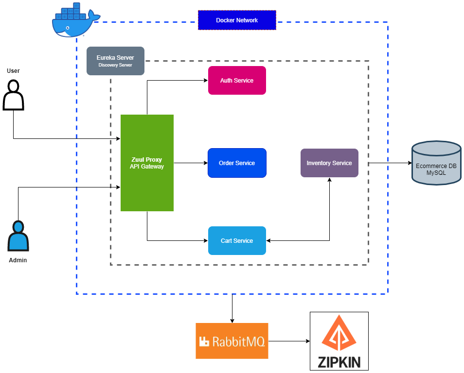

# Ecommerce App - Microservice
## Overview
Is a simple ecommerce app using Spring Boot in a microservice architecture.\
**The following services:**
- **Authorization Service**
  - In charge of authentication and authorization
- **Cart Service**
  - Keeps track of the current user's cart
- **Inventory Service**
  - Keeps the details and stock of a particular product (Also used for validation during checkout)
- **Order Service**
  - Service for checking out the user's selected product.
- **Ecommerce Gateway Service**
  - The main entry point of incoming requests to be routed to a particular service.
- **Discovery Server**
  - Server that is incharge of exposing different services to bridge communication between microservices

## Table of Contents

- [Objective](#objective)
- [Technologies And Tools](#technologies-and-tools)
- [How to run the app](#how-to-run-the-app)
- [Diagrams](#diagrams)
  - [System Architecture](#system-architecture)

## Objective
- To create an ecommerce app in a microservice architecture using Spring Boot.
- To deploy the application in a containerize fashion using Docker. Using a docker compose script.
- To familiarize more and increase knowledge with regards to a microservice architecture.
- To practice TDD and usang of CI tools (Used Github Actions for this project).

## Technologies and Tools
**Language:** Java\
**Libraries and frameworks:** Spring Boot, Spring Cloud, Feign Client, Zuul Proxy Gateway, Spring Data JPA, Sleuth\
**Tools:** Postman, Zipkin (For distributed tracing) and RabbitMQ (For persisting messages) and Docker (Containerization)\
**Test:** Junit and Mockito
**C/I (Continous Integration)**: Github Actions

## How to run the app
- Navigate to the root directory of the project. then execute this command. (Please check if docker daemon is up and running). *I'm expecting you have a docker installed in your local.*
```
docker compose up
```
- To access RabbitMQ web console.
  - Go to `http://localhost:15672/`
  - Use this credentials to enter RabbitMQ console. user: `guest` password: `guest`
- To access Zipkin
  - Go to `http://localhost:9411/zipkin/`. To check the visualization of requests
- Import postman request [located here](./postman-requests/e-commerce-postman-request-collection.json). To start sending request to the app.
  
## Diagrams
### System Architecture


